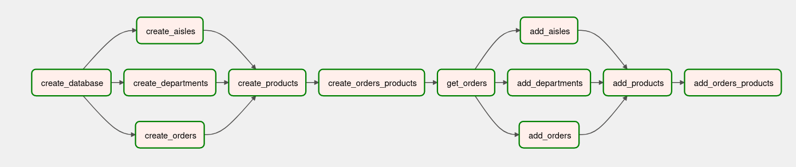

# Store orders pipeline using airflow

## Objective:

- Get the orders data from a FastAPI instance and convert it into relational tables using an airflow pipeline.

## Process Description:

- Data is obtained from kaggle instacart market basket analysis competition. 

- The data is originally split into different related files. I has been combined into one file.

- Data from this combined file is exported through an api created using FastAPI. In one call data of
between 3-10 orders (number of order is randomly chosen) of sequential orders is sent.

- This data is split into 5 related tables and stored into a postgres database.

## Original table columns:

1. id
2. user_id
3. order_number 
4. product 
5. department 
6. aisle 
7. add_to_cart_order 
8. reordered 
9. order_dow 
10. order_hour_of_day 
11. days_since_prior_order

## Split tables:

**Note:** 'F' denotes foreign key. 

1. Aisles:

| id | aisle |
|----|-------|
|    |       |

2. Departments:

| id | department |
|----|------------|
|    |            |

3. Products:

| id | product | aisle_id (F) | dept_id (F) |
|----|---------|--------------|-------------|
|    |         |              |             |

aisle_id -> aisles(id)
dept_id -> departments(id)

4. Orders:

| id | user_id | order_number | order_dow,order_hr_of_day | days_since_prior_order |
|----|---------|--------------|---------------------------|------------------------|
|    |         |              |                           |                        |

5. Orders_products:

| order_id (F) | product_id (F) | add_to_cart_order | reordered |
|--------------|----------------|-------------------|-----------|
|              |                |                   |           |

order_id -> orders(id)
product_id -> products(id)

## Graph view of DAG:

